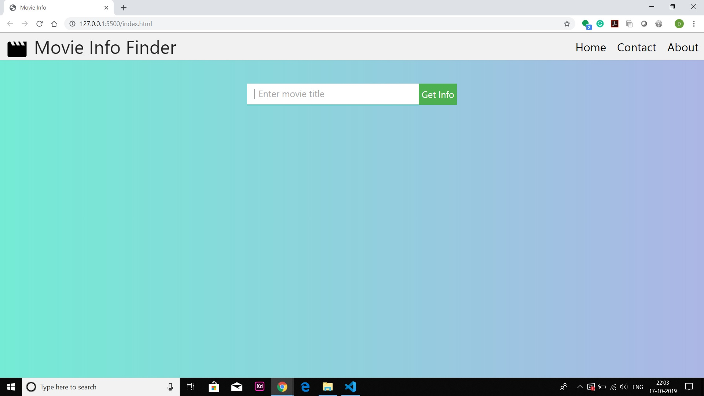
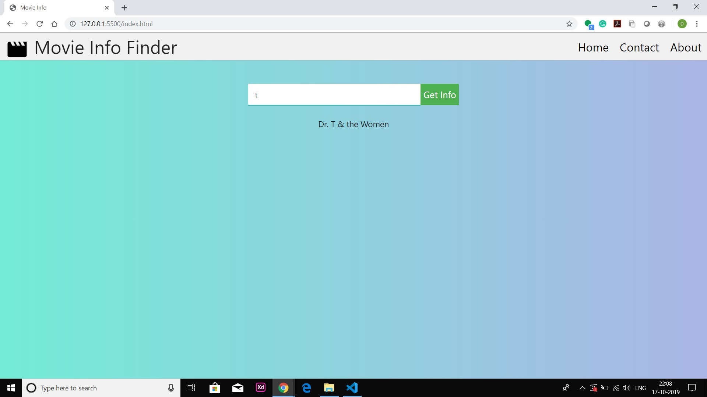
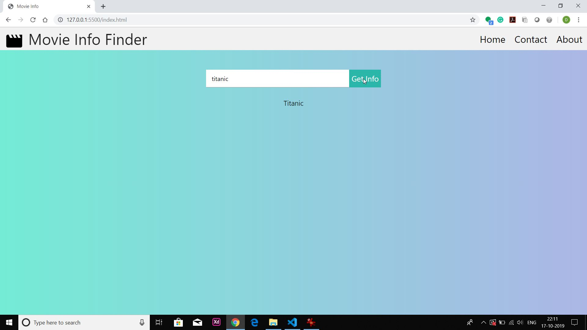
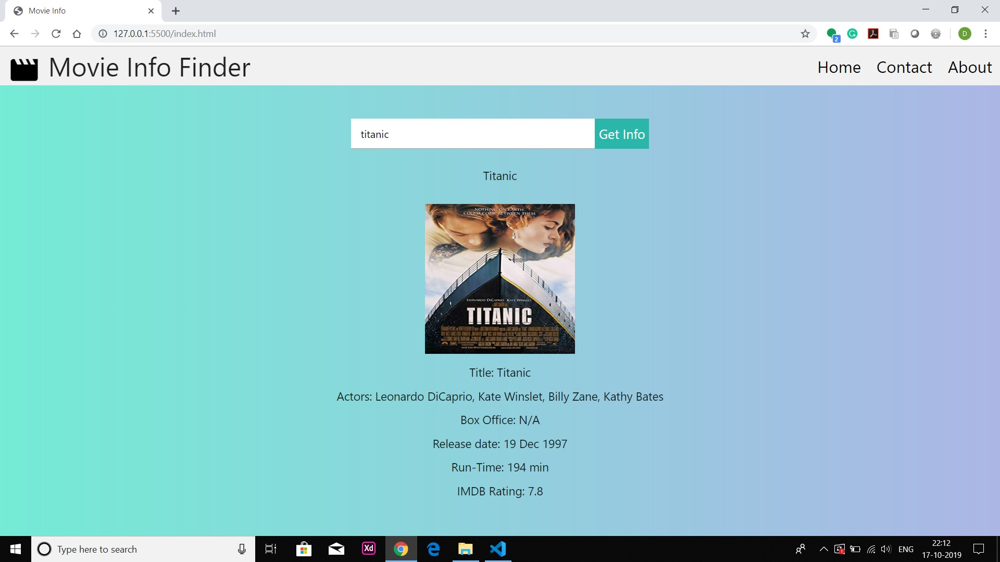
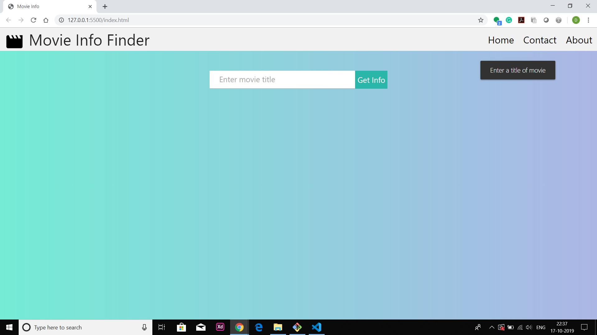
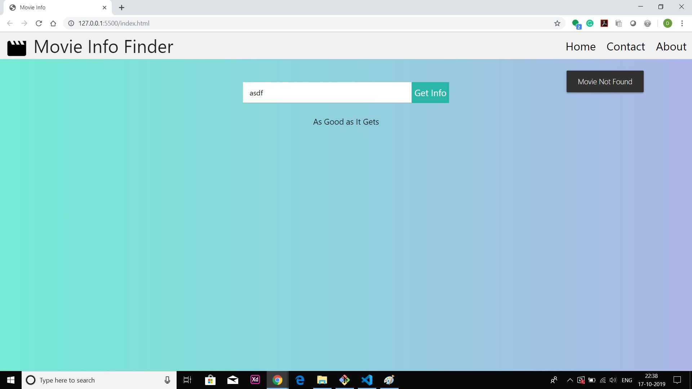
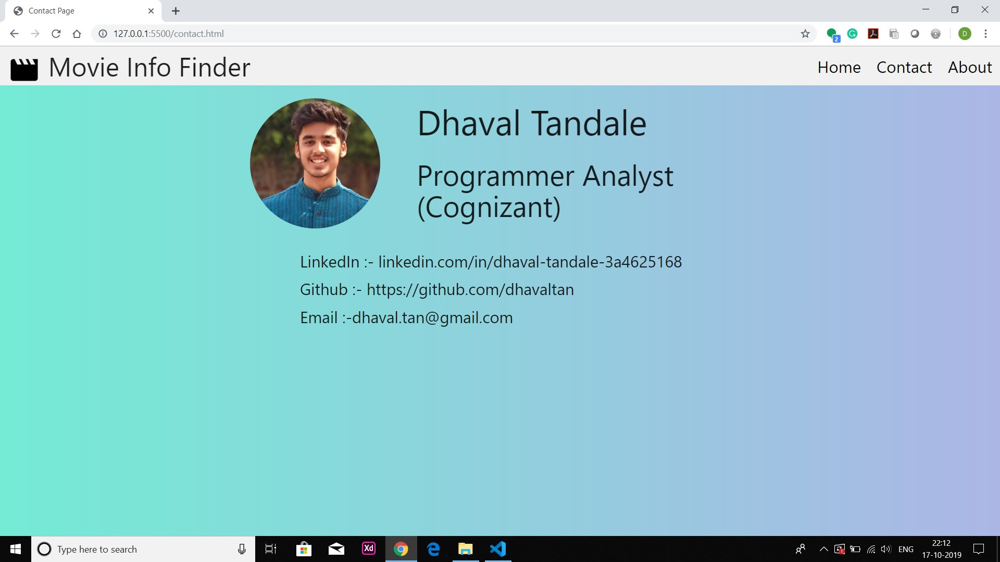
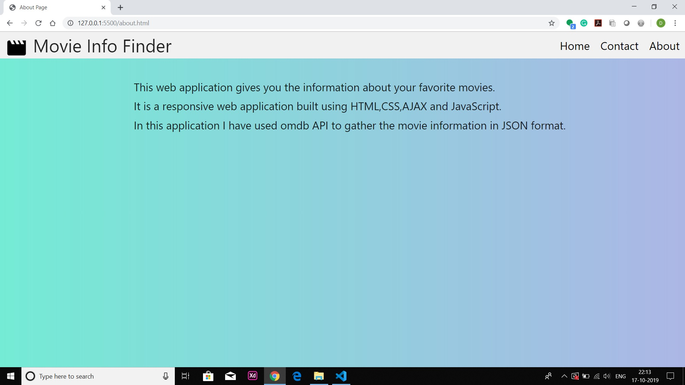

# Movie Info Finder

#### Use different apikey for flawless performance.
#### Get the api key by registering on http://www.omdbapi.com/apikey.aspx and replace it in index.js file
_____
### Screenshots :
#### 1.Home page of application
</img>
_____
#### 2.Search for your favorite movie/series title
</img>
_____
#### 3.Application gives you suggestion for title
</img>
_____
#### 4.Click on the Get info button
</img>
_____
#### 5.Information about movie/series is displayed
</img>
_____
#### 6.If empty value is submitted then valid toast is displayed
</img>
_____
#### 7.If movie/series not found then valid toast is displayed
</img>
_____
#### 8.Contact page
</img>
_____
#### 9.About page
</img>
